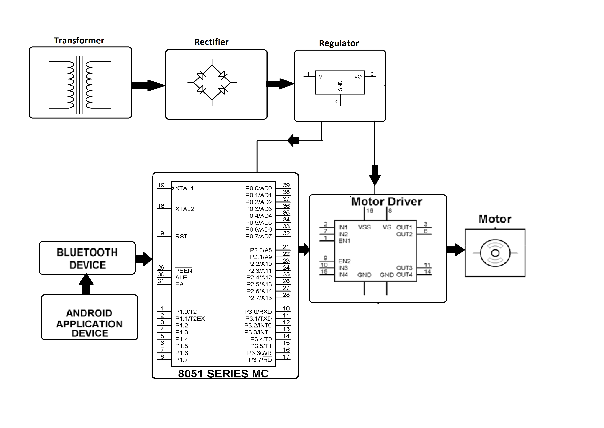
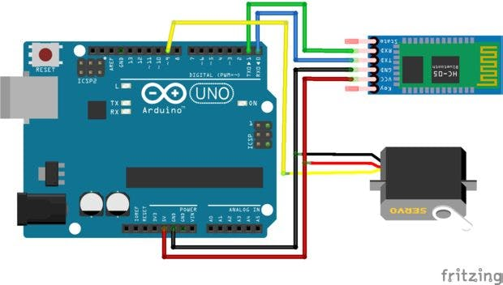
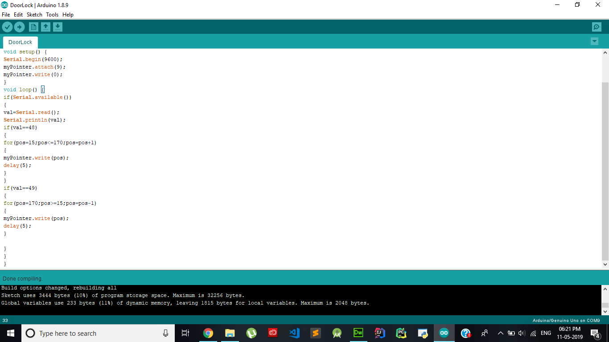

# ANDROID-PASSWORD-BASED-REMOTE-DOOR-OPENER-SYSTEM-USING-ARDUINO
The aim of the project is to create a remote password based door opener system through an android application. Where the system tends to make a secure door opening mechanism such that the door only unlocks when the password entered is correct through an android application. As soon as commands are sent through the android device a Bluetooth receiver is used to receive those commands. These commands are then sent to the 8051 microcontroller. The microcontroller processes these commands and then tallies the password to check its correctness. If the right password is encountered it sends command to open the door. The main objective is to create a password based opening door which works on Microprocessor 8051 and the door only responds when the password is correct this way it can be more secure and protective.

## Block Diagram

## Architecture Used

## Algorithm
- Make all the connections
- Compile and Upload the Arduino code in the Arduino IDE
- Make sure to remove the TX and RX pins before uploading the code
- Download and Install Bluetooth Arduino Controller in your Android phone
- Open the app and search for Bluetooth devices, and select HC-05 in Switch Mode
- Configure the Switch mode, which sends the specific ASCII values to the Bluetooth Module HC-05 which in turns opens and closes the door accordingly

## Results
The code for Bluetooth control smart door lock is very simple. We have designed android application in such a way that it sent a command with the password. Actually we set two command, one is "OPEN=" which has a password associated with and another is "CLOSE=" which has another set of password associated with it and password may contain any digit, later or symbol or combination of them as you like. In the app we used two buttons one for open the door and another for closing the door. When password is given to password box and open
button is clicked than app joint the "OPEN=" command with the password and sent it to Arduino. We add '=' sign with command for that we will separate command and password by using this '= ‘. After receiving the string from phone Arduino program separates command and password from the receive string and save them into two separate variables. Then check the password first, if password matched with saved password then open the door for "OPEN" command, and close the door for "CLOSE" command. "=" helps to separate command and password. Complete Arduino sketch is given below.

## Conclusion
After this arrangement we finally get an Android Password based Door opening and Closing system which can be accessed on the basis of Bluetooth. HC-05 module is an easy to use Bluetooth SPP (Serial Port Protocol) module, designed for transparent wireless serial connection setup. With the help of HC-05 and a Tower Pro SG 90, we successfully implemented a Door opening and closing system using an Android application wirelessly which is Password Protected.
